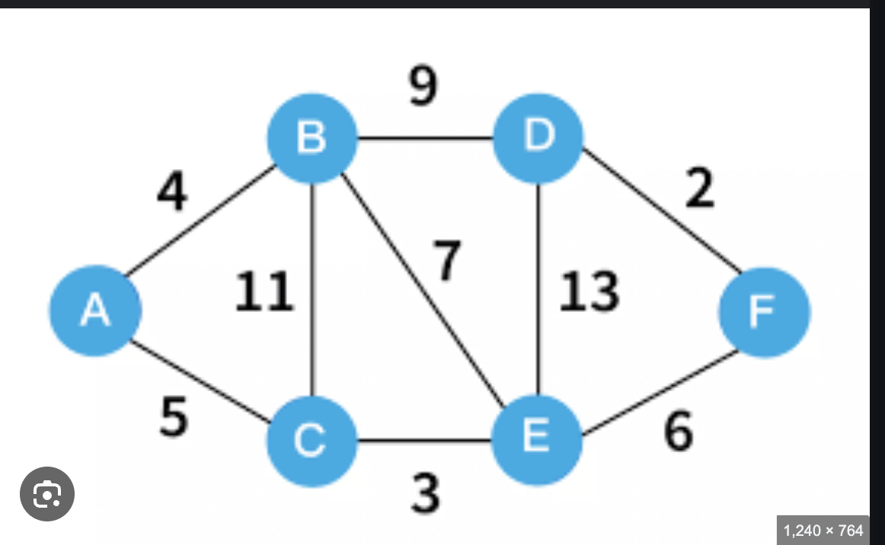

# Shortest Path traversals.

## Single source traversal

### Dijkstra's Algorithm

- It works only with positive-edge values
- It follows a greedy algorithm
- Cannot detect negative cycles
- It Doesn't work well when the graph has negative edges.
- Time complexity is O(ElogV)



```java
import java.util.*;

public class Dijkstra {
    private final Map<Vertex<T>, List<Edge<T>>> incomingNodes = new HashMap<>();
    private final Map<Vertex<T>, List<Edge<T>>> outgoingNodes = new HashMap<>();
    private final Set<Vertex<T>> vertices = new HashSet<>();
    private final Set<Vertex<T>> startNodes = new HashSet<>();

    public static class Vertex<T> {
        T data;

        Vertex(T data) {
            this.data = data;
        }
    }

    public static class Edge<T> {
        Vertex<T> src;
        Vertex<T> dst;
        int cost;

        Edge(Vertex<T> src, Vertex<T> dst, int cost) {
            this.src = src;
            this.dst = dst;
            this.cost = cost;
        }

        Edge(Vertex<T> src, Vertex<T> dst) {
            this.src = src;
            this.dst = dst;
            this.cost = 0;
        }
    }

    public static <T> Vertex<T> createVertex(T data) {
        return new Vertex<>(data);
    }

    public void addEdge(Vertex<T> src, Vertex<T> dst) {
        Edge<T> fromTo = new Edge<>(src, dst);
        Edge<T> toFrom = new Edge<>(dst, src);
        // This is to create a bidirectional connection between both the vertices
        outgoingNodes.computeIfAbsent(src, v -> new LinkedList<>()).add(fromTo);
        incomingNodes.computeIfAbsent(dst, v -> new LinkedList<>()).add(toFrom);
        vertices.add(src);
        vertices.add(dst);
    }

    public static class NodeDist<T> {
        Vertex<T> v;
        int dist;

        NodeDist(Vertex<T> vx, int cost) {
            this.v = vx;
            this.dist = cost;
        }
    }

    public boolean isValid(NodeDist<T> nd, Map<Vertex<T>, Integer> costMap) {
        return (costMap.get(nd.v) <= nd.cost);
    }

    public void dijkstraImpl(Vertex<T> root) {
        if (root == null) return;
        Map<Vertex<T>, Integer> costMap = new HashMap<>();
        Set<Vector<T>> processed = new HashSet<>();

        PriorityQueue<NodeDist<T>> pq = new PriorityQueue<>(Comparator.comparingInt(v -> v.dist));

        // Initialise all the distances with MAX_VALUE
        for (Vertex<T> v : vertices) {
            costMap.put(v, Integer.MAX_VALUE);
        }
        costMap.put(root, 0);
        pq.add(root);

        while (!queue.isEmpty()) {
            NodeDist<T> ele = pq.poll();
            if (ele == null || !isValid(ele, costMap) || processed.contains(ele.v)) continue;

            // List of reachable nodes from the current node.
            List<Edge<T>> edges = outgoingNodes.get(root);
            int costUntil = costMap.get(ele.v);
            // costUntil provides the cost until this current node.

            for (Edge<T> e : edges) {
                // If this node is already processed the do not move forward.
                if (processed.contains(e.dst)) continue;

                Vertex<T> dst = e.dst;
                int cost = e.cost;
                int prevCost = costMap.get(dst);
                int minCost = Math.min(cost + costUntil, prevCost);
                pq.add(new NodeDist<T>(e.dst, minCost));
            }
            // Add node to processed 
            processed.add(ele.v);
        }

    }
}
```

### Bellman-Ford Algorithm

- Algorithm is designed to work even for negative edges
- It can detect negative cycles, i.e. any path leading to negative weights
- It works on principle that any shortest path between V vertices can have at max V-1 edges.
- So the algorithm operates by relaxing edges V-1 times

```java

import java.util.ArrayDeque;
import java.util.HashMap;
import java.util.List;
import java.util.Queue;

public class BellmanFord {
    private final Map<Vertex<T>, List<Edge<T>>> incomingNodes = new HashMap<>();
    private final Map<Vertex<T>, List<Edge<T>>> outgoingNodes = new HashMap<>();
    private final Set<Vertex<T>> vertices = new HashSet<>();
    private final Set<Vertex<T>> startNodes = new HashSet<>();

    public static class Vertex<T> {
        T data;

        Vertex(T data) {
            this.data = data;
        }
    }

    public static class Edge<T> {
        Vertex<T> src;
        Vertex<T> dst;
        int cost;

        Edge(Vertex<T> src, Vertex<T> dst, int cost) {
            this.src = src;
            this.dst = dst;
            this.cost = cost;
        }

        Edge(Vertex<T> src, Vertex<T> dst) {
            this.src = src;
            this.dst = dst;
            this.cost = 0;
        }
    }

    public static <T> Vertex<T> createVertex(T data) {
        return new Vertex<>(data);
    }

    public void addEdge(Vertex<T> src, Vertex<T> dst) {
        Edge<T> fromTo = new Edge<>(src, dst);
        Edge<T> toFrom = new Edge<>(dst, src);
        // This is to create a bidirectional connection between both the vertices
        outgoingNodes.computeIfAbsent(src, v -> new LinkedList<>()).add(fromTo);
        incomingNodes.computeIfAbsent(dst, v -> new LinkedList<>()).add(toFrom);
        vertices.add(src);
        vertices.add(dst);
    }

    public void bellmanFordImpl(Vertex<T> start) {
        if (start == null) return;
        Map<Vertex<T>, Integer> cost = new HashMap<>();
        Set<Vertex<T>> processed = new HashSet<>();
        Queue<Vertex<T>> vertexQueue = new ArrayDeque<>();
        //Initialise the map with infinite values
        for (Vertex<T> v : vertices) {
            cost.put(v, Integer.MAX_VALUE);
        }
        //Initialise the start to 0.
        cost.put(start, 0);
        int max = vertices.size() - 1;
        vertexQueue.add(start);
        for (int i = 0; i < max; i++) {

            Vertex<T> node = vertexQueue.poll();
            List<Edge<T>> edges = outgoingNodes.get(start);
            for (Edge<T> e : edges) {
                Vertex<T> dst = e.dst;
                int costOfEdge = e.cost;
                cost.compute(dst, (k, v) -> Math.min(costOfEdge + cost, v));
                vertexQueue.add(e.dst);
            }
            processed.add(node);

        }
    }
}

```

### Floyd-Warshall Algorithm

- This algorithm is an all-pair shortest path algorithm unlike Dijkstra's and BellmanFord
- Doesn't work on negative cycles
- Works on DP approach check every possible path going via every possible node in order to calculate shortest distance
  between every pair of nodes.

```java

class FloydWarshall {
    public void floydWarshallImpl(int[][] g) {
        int[][] res = new int[g.length][g[0].length];
        for (int i = 0; i < g.length; i++) {
            for (int j = 0; j < g[i]; j++) {
                if (i == j) {
                    res[i][j] = 0;
                    continue;
                }
                res[i][j] = g[i][j] != Integer.MAX_VALUE ? g[i][j] : Integer.MAX_VALUE;
            }
        }
        int n = g.length;
        for (int i = 0; i < n; i++) {
            for (int j = 0; j < n; j++) {
                for (int k = 0; k < n; k++) {
                    if (i == j) continue;
                    res[i][j] = Math.min(res[i][j], res[i][k] + res[k][j]);
                }
            }
        }
    }
}
```