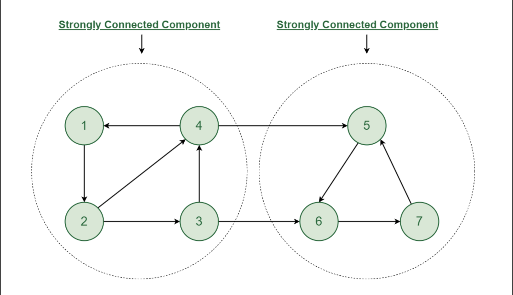

# Strongly Connected Components

SCC is a subgraph in a graph in which all the vertices are reachable from each other. I.e. there exists a path for
every (u,v).
They have various applications

1. Networks
2. Social graphs
3. Web crawlers

Strongly Connected is applicable only to directed graphs. A subgraph of a directed graph is considered to be an Strongly
Connected Components (SCC) if and only if for every pair of vertices A and B, there exists a path from A to B and a path
from B to A.



While we can start traversing this in DFS method, all the nodes are reachable from node1.
For ex:

```java
/**
 * vis [f,f,f,f,f,f,f]
 * dfs(1) [t,f,f,f,f,f,f]   dfs(1) [t,f,f,f,f,f,f]  
 * dfs(2) [t,t,f,f,f,f,f]   dfs(2) [t,t,f,f,f,f,f]
 * dfs(3) [t,t,t,f,f,f,f]   dfs(3) [t,t,t,f,t,t,t]
 * dfs(6) [t,t,t,f,f,t,f]   dfs(4) [t,t,t,t,t,t,t]
 * dfs(7) [t,t,t,f,f,t,t]
 * dfs(5) [t,t,t,f,t,t,t]
 */

```
But we can traverse from 5 back to 1. This creates 2 strongly connected components, essentially a cycle of edges.

Kosaraju Impl
```java
class KosrajuSCC {
    
    public void kosarajuImpl(Vertex<T> root) {
        Stack<Vertex<T>> stack = new Stack<>();
        Set<Vertex<T>> vis = new HashSet<>();
        dfs(root, stack, vis);
        System.out.println("");
        Map<Vertex<T>, List<Edge<T>>> transpose = transpose();
        transposeAndVisit(stack.peek(), stack, new HashSet<>(), new LinkedList<>(), transpose);
    }

    private Map<Vertex<T>, List<Edge<T>>> transpose() {
        Map<Vertex<T>, List<Edge<T>>> m = new HashMap<>();
        outgoingNodes.forEach(
                (tVertex, edges) -> {
                    List<Edge<T>> newEdges = new ArrayList<>();

                    if (!m.containsKey(tVertex)) {
                        for (Edge<T> e : edges) {
                            Edge<T> x = new Edge(e.dst, e.src);
                            newEdges.add(x);
                        }
                        m.put(tVertex, newEdges);
                    }
                });
        return m;
    }

    public void transposeAndVisit(
            Vertex<T> root,
            Set<Vertex<T>> seen,
            List<Vertex<T>> inPath,
            Map<Vertex<T>, List<Edge<T>>> transpose) {
        if (root == null) return;

        if (seen.contains(root)) {
            System.out.println("Scc");
            System.out.println(inPath);
            inPath = new LinkedList<>();
        } else {
            seen.add(root);

            List<Edge<T>> edges = transpose.get(root);
            if (edges == null || edges.isEmpty()) return;
            inPath.add(root);
            for (Edge<T> tEdge : edges) {
                transposeAndVisit(tEdge.src, seen, inPath, transpose);
            }
        }
    }

    private void dfs(Vertex<T> root, Stack<Vertex<T>> stack, Set<Vertex<T>> seen) {
        if (root == null) return;
        if (seen.contains(root)) {
            return;
        }

        seen.add(root);

        List<Edge<T>> edges = outgoingNodes.get(root);
        if (null == edges || edges.isEmpty()) return;
        for (Edge<T> e : outgoingNodes.get(root)) {
            dfs(e.dst, stack, seen);
        }
        stack.push(root);
    }
}
```