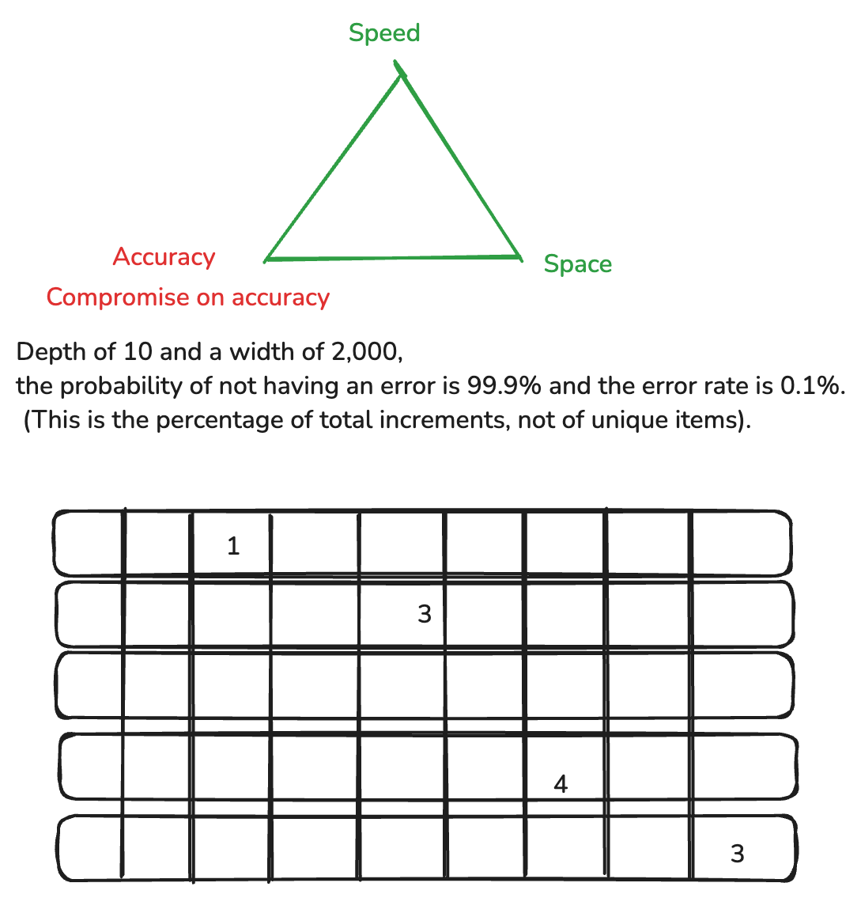

# Count Min Sketch

## What is CMS?
CMS is a probabilistic data structure that is used to estimate the items in a continuous stream in sub linear time.
It is efficient in terms of storing and reterving their counts very fast.

## Use Cases for CMS
1. Video view counts
2. Instagram post likes/comments
3. Top K songs in Spotify
4. Top K tweets
5. Top K celebrities

### How does it work under the hood?

CMS has an 2D table that is two major attributes which defines size of the table.
1. Error rate
2. Confidence

The error in CMS is due to hash collisions: different items may hash to the same position and inflate each other's counts.
Estimated  Count≤True Count+εN

Accuracy of the counts of elements

The two key parameters in CMS are:

Width (w) – number of counters per row

Depth (d) – number of hash functions (rows)

##To control error and probability:

Set
𝑤 = ⌈ 𝑒 / 𝜀 ⌉
w=⌈e/ε⌉

Set
𝑑 = ⌈ ln ⁡(1 / 𝛿)⌉
d=⌈ln(1/δ)⌉

Where:
ε = maximum error rate you’re willing to accept
δ = probability that the estimate exceeds that error (i.e., confidence is 1 − 𝛿 1−δ)

