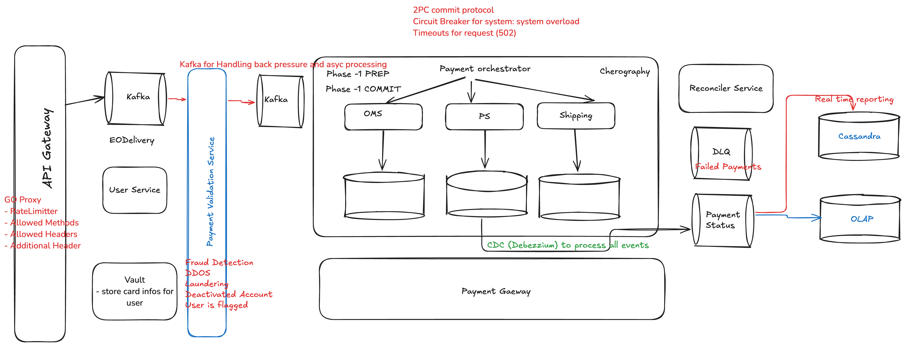

# Payment Processing

## Functional Requirements
1. User should be able to add product to cart and make their payment.
2. User should be able to choose payment type.
3. User should be able to directly checkout to payment.
4. User should be able to retry on failed payment

//retries for failed payments, security

## Non Functional
1. System should be scalable
2. System should be highly secure
3. System should be resilient to failures (Fault Tolerant)
4. Restricted access

## Capacity Estimation
DAU - 10 mil
Reads - Less compared to writes.
1:10 - R:W
10Mil reads 
100Mil writes - 1200 writes/sec

1KB - 10^8*10^3 = 10^12 TB

Choice of DB - Relational Database
1. Locking. 
2. Isolation - REPEATABLE_READ/PHANTOM READS
3. Atomicity 
4. Durability

## DB Choice
1. P-SQl (PG Bouuncer Connection pooling
2. Patron for replication to slaves.
3. Citus for Sharding
4. Partitioned by GEO

```sql
create table user(
    first_name varchar,
    last_name  varchar,
    email varchar
    user_id bigint
    display_name varchar 
);
create index user_id_idx user on (user_id) INCLUDE (first_name, last_name);

create table order(
    order_id bigint,
    user_id bigint,
    product_id bigint,
    product_name varchar,
    create_ts timestamp utc,
    last_updated_ts timestamp utc
) PARTITION BY RANGE (start_time) 

-- create new table of partition for year 2024
CREATE TABLE orders_05_2025 ( LIKE orders INCLUDING ALL );

-- Attach this newly created partition for year 2024
ALTER  TABLE orders ATTACH PARTITION orders_05_2025 
 FOR VALUES FROM ('2025-01-01') TO ('2025-05-31'); 
 
create table payment(
    payment_id bigint,
    currency enum,
    type enum,
    status enum,
    start_time timestamp utc,
    retry_id bigint,
    create_ts timestamp utc,
    last_updated_ts timestamp utc
) PARTITION BY RANGE (start_time);

-- create new table of partition for year 2024
CREATE TABLE payment_2024 ( LIKE payment INCLUDING ALL );

-- Attach this newly created partition for year 2024
ALTER  TABLE payment ATTACH PARTITION payment_2024 
 FOR VALUES FROM ('2024-01-01') TO ('2024-12-31');
```

```declarative
/v1/authz/sso
JWT token

POST {{baseUrl}}/v1/payments
 Authorisation: Bearer <>
 api-key: <>

Body {
    user_info
    order_info
    payment_info
}
    200 OK
    201 ACCEPTED
    500 ERROR
    429 TOO Many requests
    409 Conflict
Respone
{"payment_id":"ulid"}

GET {{baseUrl}}/v1/payments/{payment_id}

PUT {{baseUrl}}/v1/payments/retry/{payment_id}
Authorisation: Bearer <>
api-key: <>

POST {{baseUrl}} /v1/disputes/
Authorisation: Bearer <>
api-key: <>

POST {{baseUrl}}/v1/disputes/:dispute/close
Authorisation: Bearer <>
api-key: <>
```



