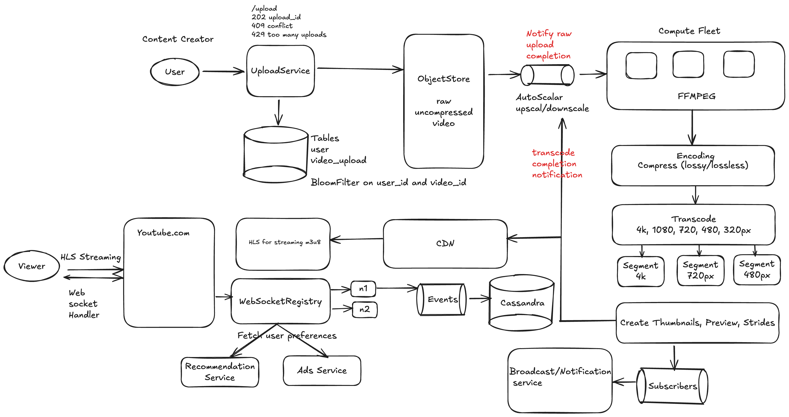

# Design Youtube

## Features

1. Uploading vides
2. Viweing videos
3. Searching for videos
4. Youtube Live
5. Youtube Music
6. Shorts

## Requirements

### Functional
There are 2 personas we need to deal with - 
1. Content creator: who creates and uploads content
2. Viewer - Who views the content on platfrom

### Non Fucntional
1. System should be scalable as we expect more and more users to upload and view.
2. Fault tolerant
3. Highly Available
4. Usability

## Design
### Services :
1. Upload Service - User uploads video into system
2. Recemmondation Service - Upon login, load the user relavant videos
3. Ads Service - Load ads
4. Broadcast Service - Upon upload completion, notify subscribers




Table Design

```sql
create table video(
    video_id uuid,
    user_id string,
    status string,
    title string
)
create index video_user_idx on video(video_id, user_id);

create index video_user_idx on video(video_id, status);

create index videobloom on video using bloom (user_id, title);
```
Blooom filter will help us to quickly check if there is another instance of upload initatited from user for same video.

Definitely NO if its doesn't or else go through.

