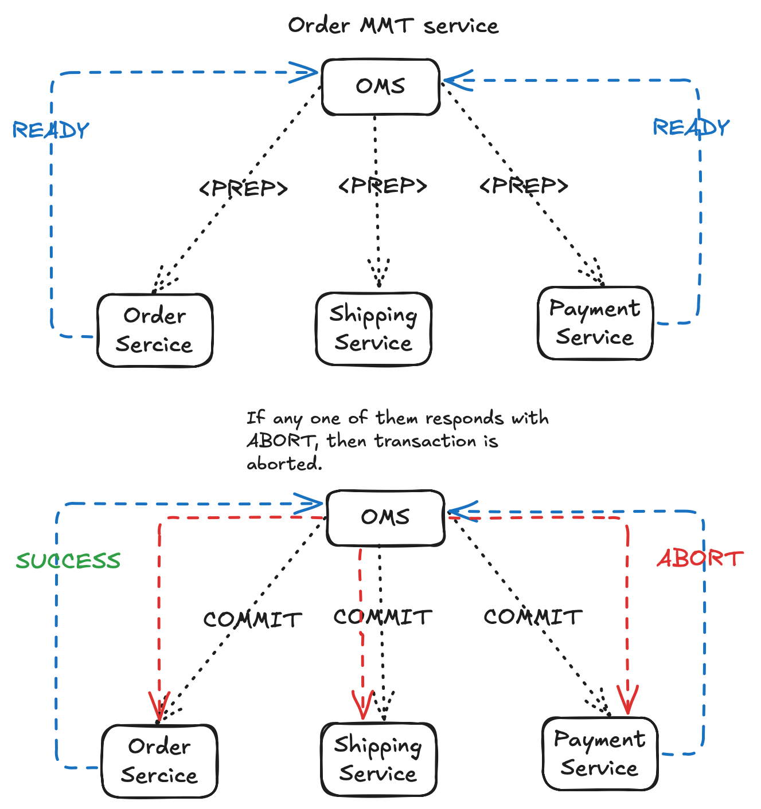

# Two Phase commit protocol

## Details
In a distributed system when there are multiple systems involved, each of these systems having their own databases it is 
important to ensure that we still preserve the ACID properties of transaction. 

To have 2PC in place, we need parties to have one coordinator and rest of the nodes as participants.
Coordinator plays role as master, to roll forward or roll back transactions.

Phase -1 : PREPARE Phase
When there needs a transaction to be persisted following steps happen:
1. TM (Transaction Manager) from Coordinator nodes sends an Prepare message to its respective participants.
2. All the participants, based on their workload, respond with READY/ABORT message.
3. When an participant sends an READY message it formally indicates that it is going to process this transaction.
    To ensure that it can send an irreversible commitment, it has to complete on-going transactions.

Phase -2 : COMMIT Phase
1. In this phase, coordinator writes an Commit log and sends COMMIT message to all nodes.
2. When all the nodes have succeeded, it will commit its transaction. 
3. If any one of the nodes respond with ABORT message, it will request rest of the other nodes/services to rollback their transaction.

HLD
