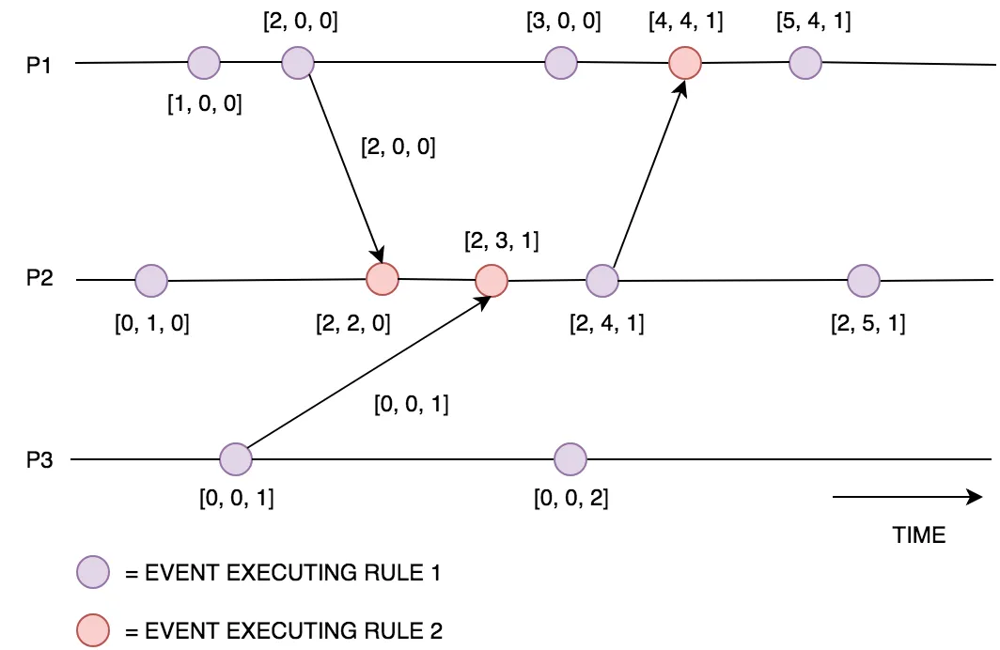

# Clocks in distributed systems.

## Ordering of Events.
Ordering of events becomes critical in distributed systems to identify if an Event e1 happened before Event e2, this will ensure that we have the most recent data in system and its consistent always.
Timestamps cannot be used/relied on to ensure the ordering of events since, and timestamps across two different machines can be out of sync.


### Lamport Clock
Lamport clock order the events with help of monotonic increasing number, every time a process sends data to another it will increase its seq_id and propagate data+seq_id to its recipient. 
Received upon receiving and event, it would start by comparing its own seq_id with newly received event, and which every is the most recent, it will update its own seq_id with most recent value and post processing the data it would increment it by 1.

```declarative
time = 0
Server A : (time+1); => Server B
Server B : time = Math.max(time, event.time); => Server C
Server C = time = Math.max(time, event.time); => Server A

```

#### Problem with Lamport clock
Since lamport clock uses same scalar value to update and maintain its time, its looses its state with regards to concurrent events.
This is due to single number used for local and global event tracking. In order to solve this Vector clocks are used.


## Vector Clocks
Vector clocks maintains state for every process, for example if there are 3 processes involved (p1,p2,p3) then 
it would maintain 3 distinct clocks for each of these processes [Vp1, Vp2, Vp3].



You can see that when ever a process received an event, it would refer to its process vector clock and updates it value.

For ex: when p1 sends event to p2, then p2 would compare its value i.e. Vp2 and then increment its value by 1.

Vector Clocks provide a causally consistent ordering of events, however this does come at a price. 
You can see that we need to send the entire Vector to each process for every message sent, in order to keep the vector clocks in sync. When there are a large number of processes this technique can become extremely expensive, as the vector sent is extremely large.

Dynamo DB relies on vector clocks to order their events, since its and K,V store, and Value is essentially a JSON,
this will cause conflicts when multiple clients try to update different fields at same time.
Dynamo DB leverages vector clocks to resolve conflicts and in case if it cannot last write wins.
