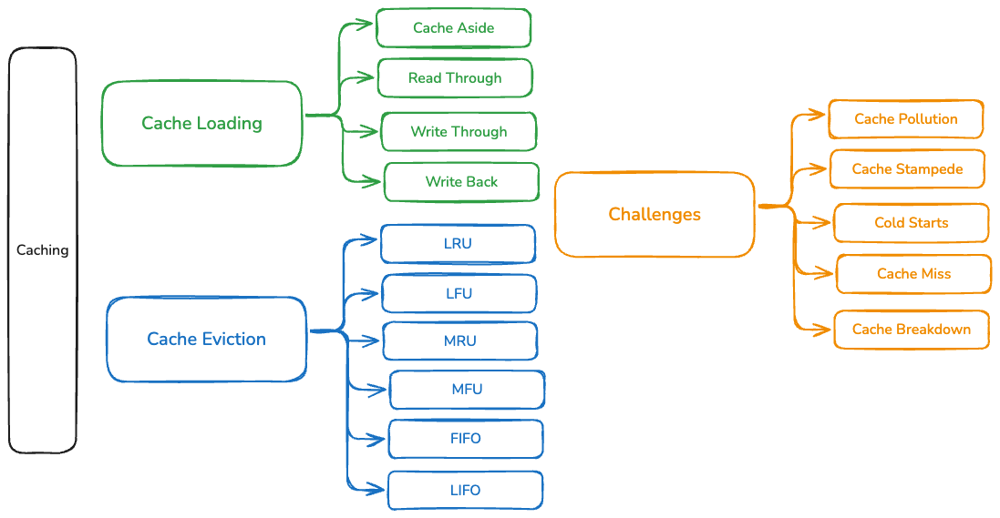

# Caching 

## Caching Intro 
Caching allows faster retrieval of data for frequently access items and improves the user experience and reduces 
load on database allowing most of these queries to be served from cache.

### Cache Loading
It becomes important for system to make this data available in cache or load this data into cache.
Cache loading has various access patters

- Cache Aside
- Read Through
- Write Through
- Write Back
- Refresh Ahead

Cache Aside - In this pattern, cache resides next to database, and everytime when an item is queried and if there is an 
cache miss, this item will be served from database also, **this item will be loaded into cache as well.**

Read Through Cache - In this access pattern, every request is routed through cache, and if there is a cache miss, 
then subsequently this request will be served from DB and also data item will be loaded into cache.
Latency issues - There is a likelihood that there will be cache miss for in frequent data items.

Write through cache - In this access pattern, every request will have to undergo dual write, first entry is made into 
cache and then data item is persisted into cache.
Data Loss - This can cause data loss if data item could not be persisted into DB
Data Write latencies - Since every request has to undergo writes into two persistent stores and in sync operation can cause latencies.

Write back cache - In this access pattern, every request will make its way to database first and then asynchronously data item 
is persisted into cache.

