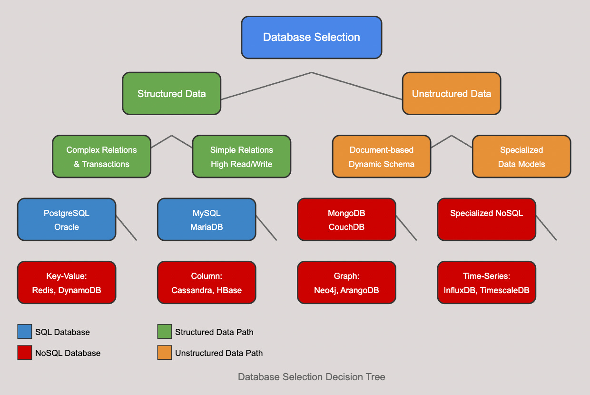

## Introduction
Selecting the right database for your application is a critical architectural decision that can significantly impact performance, scalability, and development efficiency. This guide presents a systematic approach to choosing between SQL and NoSQL databases based on your specific requirements.

## Understanding SQL and NoSQL Databases

## SQL Databases
SQL (Structured Query Language) databases organize data in tables with predefined schemas. They follow the ACID (Atomicity, Consistency, Isolation, Durability) properties and establish relationships between tables through foreign keys.

### Key characteristics:

- Structured data with rigid schemas
- Strong consistency and transaction support
- Vertical scaling primarily (scale-up)
- Mature ecosystem with standardized query language
- Powerful for complex queries and relationships
- Popular examples: PostgreSQL, MySQL, Oracle, SQL Server, MariaDB

## NoSQL Databases
NoSQL ("Not Only SQL") databases emerged to address limitations of relational databases, particularly for handling large volumes of unstructured or semi-structured data, and for horizontal scaling.

### Key characteristics:

- Flexible schemas
- Designed for horizontal scaling (scale-out)
- Often prioritize availability and partition tolerance over consistency
- Specialized for specific data models
- Typically offer simpler query capabilities

### Main types of NoSQL databases:
- Document stores (MongoDB, CouchDB)
- Key-value stores (Redis, DynamoDB)
- Column-family stores (Cassandra, HBase)
- Graph databases (Neo4j, ArangoDB)

---
# 📊 Decision Tree for Database Selection

## 1. Data Structure Requirements

**Highly-structured data:**

* Well-defined schema, rarely changing
* Clear relationships between entities
* Complex multi-entity transactions
* Strong data integrity constraints
  → **Use SQL databases**

**Semi-structured or unstructured data:**

* Evolving or schema-less data
* Document-oriented formats (JSON, XML, etc.)
* Varying attributes across similar items
  → **Use NoSQL databases**

---

## 2. Scalability Needs

**Vertical scalability (scale‑up):**

* Predictable, moderate growth
* Single-server performance is sufficient
  → **SQL databases**

**Horizontal scalability (scale‑out):**

* Massive data volumes
* Unpredictable or explosive growth
* Distributed data architecture
  → **NoSQL databases** (especially key‑value or column‑family)

---

## 3. Query Complexity

**Complex queries & transactions:**

* Multi-table joins
* Complex aggregations & reporting
* ACID transaction needs
  → **SQL databases**

**Simple queries:**

* Key‑based lookups
* High read/write throughput
* Document‑centric operations
  → **NoSQL databases**

---

## 4. Consistency Requirements

**Strong consistency required:**

* Financial systems
* Inventory management
* Critical data accuracy
  → **SQL databases**

**Eventual consistency acceptable:**

* Social media
* CMS platforms
* Analytics systems
  → **NoSQL databases**

---

## 5. Development Speed & Flexibility

**Structured, predictable development:**

* Fixed data models
* Strong validation and constraints
  → **SQL databases**

**Rapid, agile development:**

* Frequently evolving data models
* Microservices architecture
* Fast iterations
  → **NoSQL databases**

---

## 🧭 Choosing the Right NoSQL Type

Once **NoSQL** is the preferred choice, select the appropriate subtype:

* **Document Stores**
  Ideal for flexible, complex data with limited relationships (e.g., CMS platforms, product catalogs).

* **Key‑Value Stores**
  Best for simple models requiring ultra-fast access (e.g., caching, session stores).

* **Column‑Family Stores**
  Built for massive, distributed data with high write rates (e.g., time-series, IoT).

* **Graph Databases**
  Specialized for deeply interconnected data (e.g., social networks, recommendation engines, fraud detection).

---

## 🗂 Summary Table

| Decision Factor             | SQL                         | NoSQL                                        |
| --------------------------- | --------------------------- | -------------------------------------------- |
| **Data Structure**          | Structured, relational data | Schema-less or semi-structured documents     |
| **Scalability**             | Vertical (scale-up)         | Horizontal (scale-out)                       |
| **Query Complexity**        | Joins, ACID, reporting      | Simple key-based access, document ops        |
| **Consistency**             | Strong consistency          | Eventual consistency acceptable              |
| **Dev Speed / Flexibility** | Fixed schema, validation    | Agile, evolving schema                       |
| **NoSQL Subtype**           | —                           | Document / Key‑Value / Column‑Family / Graph |

---

Feel free to integrate this into your README, adjust the icons, or tweak the wording to match your project's guidelines.

## NoSQL Database Types

### Document Stores
Best for applications with complex but flexible data structures that don't require many relationships. Examples include content management systems and e-commerce product catalogs.

### Key-Value Stores
Ideal for simple data models requiring high performance and scalability. Perfect for caching, session management, and real-time applications.

### Column-Family Stores
Designed for handling massive amounts of data distributed across many servers. Great for time-series data, IoT, and systems that need to write data quickly.

### Graph Databases
Specialized for data with complex relationships and interconnections. Ideal for social networks, recommendation engines, and fraud detection systems.

### Real-World Selection Examples
Here’s a polished README-ready version using Markdown:

---

## Real‑World Selection Examples

### Example 1: E-commerce Platform 🚀

**Requirements**

* Product catalog with varying attributes
* Customer data and order history
* Inventory management
* Order processing and payment transactions

**Decision Path**

1. **Product catalog** – Varying attributes suggest a NoSQL (document) store.
2. **Customer/order data** – Relational structure suggests SQL.
3. **Inventory & transactions** – Need ACID guarantees, pointing to SQL.

**Potential Solution**

* **Polyglot persistence**:

    * Use **PostgreSQL** for transactional data (orders, inventory).
    * Use **MongoDB** for flexible product catalog.

---

### Example 2: IoT Analytics Platform 🔧

**Requirements**

* Billions of time‑stamped sensor readings
* Real‑time data ingestion
* Historical trend analysis
* Device metadata storage

**Decision Path**

1. **Sensor data** – Time-series, high volume → column-family NoSQL or time-series DB.
2. **Device metadata** – Structured → SQL or document store.
3. **Real-time** – Specialized time-series database needed.

**Potential Solution**

* Use **TimescaleDB** or **InfluxDB** for sensor (time-series) data.
* Use **PostgreSQL** for device metadata.

---

### Example 3: Social Media Application ❤️

**Requirements**

* User profiles and authentication
* Friend/follower relationships
* Content posting and sharing
* Feed generation and recommendations

**Decision Path**

1. **User profiles** – Structured data → SQL.
2. **Relationships** – Complex network → graph database.
3. **Content** – Semi-structured → document store.
4. **Recommendations** – Graph traversal → graph database.

**Potential Solution**

* Use **Neo4j** for the social graph and recommendations.
* Use **MongoDB** for content storage.
* Use **PostgreSQL** for user/account data.

---

### Summary

| Use Case      | SQL (e.g., PostgreSQL)       | NoSQL / Document (e.g., MongoDB) | Time-Series (e.g., InfluxDB) | Graph (e.g., Neo4j)            |
| ------------- | ---------------------------- | -------------------------------- | ---------------------------- | ------------------------------ |
| E-commerce    | Orders, Inventory            | Product catalog                  | –                            | –                              |
| IoT Analytics | Device metadata              | –                                | Sensor/time-series data      | –                              |
| Social Media  | User profiles/authentication | Content                          | –                            | Relationships, Recommendations |

--- 