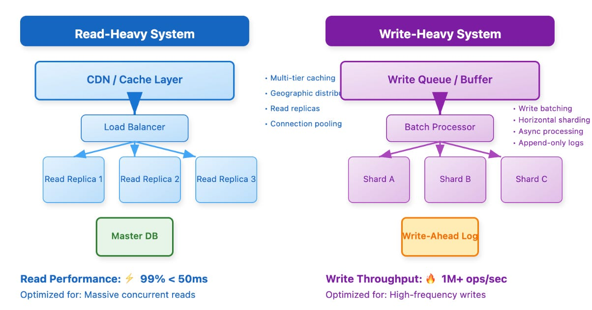
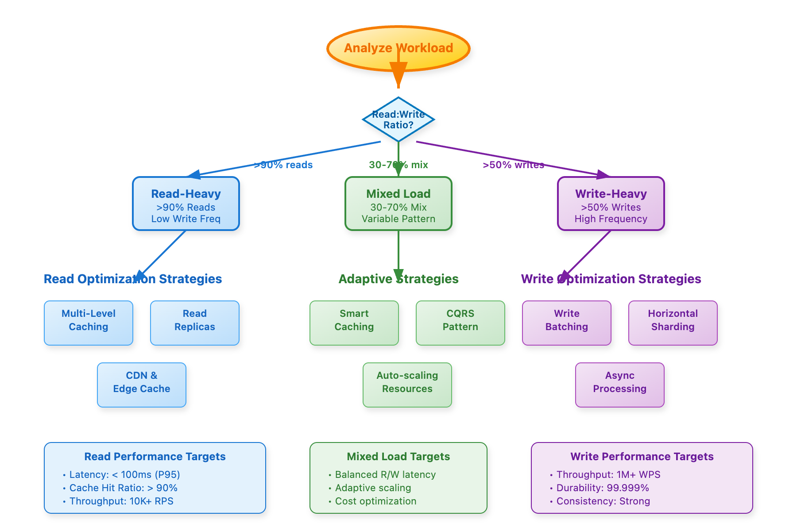

# 🏗️ 1. Multi-Tier Caching Architectures

### Netflix EVCache (Distributed Memcached)

* **Client-sharded caching**: EVCache wraps memcached with consistent hashing to shard data across nodes and AZs; reads are served locally, while writes replicate across zones for availability ([22.frenchintelligence.org][1], [GeeksforGeeks][2]).
* **Global replication via Kafka**: Netflix uses metadata-only messages in Kafka for cross-region replication, minimizing payloads and latency (sub-second 99th percentile) ([Netflix TechBlog][3]).
* **Cache warming**: New clusters are pre-warmed by dual-writing until the old cache expires, ensuring seamless capacity scaling .

### CDN + Edge + Client Caching

* **Open Connect Appliances (OCAs)**: Netflix and others place caches within ISPs. OCAs pre-populate popular content during off-peak hours, greatly reducing upstream bandwidth and latency ([Wikipedia][4]).
* **Multi-layer caching** from device/browser → CDN edge → regional caches (e.g., Netflix: 5-tier, Wix: proxy+local), optimizing latency and scaling ([22.frenchintelligence.org][1]).

---

## 🎯 2. Read-Heavy vs Write-Heavy Patterns

### Read-Heavy Systems

* **Replication + Denormalization**: Services like Spotify use geographically distributed read replicas with eventual consistency. Pinterest stores precomputed aggregates to eliminate expensive JOINs.
* **Cache aside (lazy-loading)** and **read-through caching** allow app-layer caches to maintain freshness with TTL or invalidation.

### Write-Heavy Systems

* **Kafka’s append-only log** design ensures high write throughput by using sequential disk I/O, batching, and delayed fsync ([DEV Community][5]).
* **Zero-copy transfers**: Kafka uses `sendfile()` or FileChannel.transferTo() to send data from disk directly to network sockets, minimizing CPUs cycles ([The Dev Learnings][6]).
* **Batched writes & queues**: Aggregating writes reduces I/O operations and improves efficiency.

---

## 🔧 3. Advanced Cache Optimization Patterns

### Write-Through and Write-Behind

* **Write-through caching** updates both cache and datastore synchronously—ensuring strong consistency.
* **Write-behind** defers datastore writes while acknowledging users immediately, offering higher throughput but riskier consistency.

### Memory-Mapped Files

* For write-heavy workloads, memory-mapped file I/O leverages OS page caches to improve both reads and durable writes automatically, blending benefits of RAM and disk.

---

## ⚖️ 4. Consistency vs Performance

* **Read-heavy apps**: Accept eventual consistency; e.g., Netflix caches preferences globally but uses strong consistency for billing.
* **Write-heavy apps**: Demand immediate consistency and durability—financial or transactional systems can’t accept stale data.

---

## 💡 5. Operational Considerations & Paradoxes

* **Cache invalidation paradox**: Uber experienced higher latencies because cache invalidations cascaded across microservices—resolved by using write-through and selective invalidation.
* **Workload adaptability**: High-scale systems dynamically detect shifts in read/write ratios and adjust caching, replication, and scaling strategies accordingly.

---

## 🔍 Production-Centric Checklist

### Read-Heavy Systems:

* ✅ Use read replicas (geo-aware) and denormalized storage.
* ✅ Layer multi-tier caches with TTL & client-side caching.
* ✅ Offload static content to CDNs and OCAs.
* ✅ Monitor hit/miss rates, evictions, and stale data.

### Write-Heavy Systems:

* ✅ Architect with append-only designs (LSM, Kafka).
* ✅ Batch writes, queue operations, ensure idempotency.
* ✅ Distribute load via sharding and write-optimized storage engines.
* ✅ Observe durability guarantees (fsync, replication lag).

---

## 📚 Real-World Tech Highlights

| Company     | Strategy                               | Benefits                                                                                                                       |
| ----------- | -------------------------------------- | ------------------------------------------------------------------------------------------------------------------------------ |
| **Netflix** | EVCache + Kafka-based meta-replication | Fast local reads, global scale, low latency ([DEV Community][5], [Reddit][7], [Reddit][8], [Reddit][9], [Netflix TechBlog][3]) |
| **Kafka**   | Append-only + zero-copy                | High throughput with low CPU overhead                                                                                          |
| **CDNs**    | OCAs in ISP PoPs                       | Reduced latency and transit costs                                                                                              |

---

## 🧠 Key Takeaways

1. **Choose architecture to match your workload pattern**: read-heavy favors caching and replication; write-heavy favors append-logs and batching.
2. **Layer caches thoughtfully**: combine local device caches, edge CDNs, regional caches, and global replication.
3. **Understand the consistency-performance tradeoff**: eventual consistency works for reads; writes often need strong guarantees.
4. **Design for adaptability**: detect workload shifts and adjust strategies dynamically.

---
[1]: https://22.frenchintelligence.org/2024/06/30/deep-dive-caching-in-distributed-systems-at-scale/?utm_source=chatgpt.com "Deep Dive: Caching in Distributed Systems / At Scale – ██FR█████ █INTELL███████████"
[2]: https://www.geeksforgeeks.org/system-design-netflix-a-complete-architecture/?utm_source=chatgpt.com "System Design Netflix | A Complete Architecture - GeeksforGeeks"
[3]: https://netflixtechblog.com/caching-for-a-global-netflix-7bcc457012f1?utm_source=chatgpt.com "Caching for a Global Netflix. #CachesEverywhere | by Netflix Technology Blog | Netflix TechBlog"
[4]: https://en.wikipedia.org/wiki/Tier_1_network?utm_source=chatgpt.com "Tier 1 network"
[5]: https://dev.to/konstantinas_mamonas/how-kafka-achieves-high-throughput-a-breakdown-of-its-log-centric-architecture-3i7k?utm_source=chatgpt.com "How Kafka Achieves High Throughput: A Breakdown of Its Log-Centric Architecture - DEV Community"
[6]: https://thedevlearnings.com/zero-copy-architecture/?utm_source=chatgpt.com "Zero-Copy Architecture: How Kafka Achieves Blazing Performance"
[7]: https://www.reddit.com/r/SoftwareEngineering/comments/1bdrbub?utm_source=chatgpt.com "Summary of How Netflix Ensures Highly-Reliable Online Stateful Systems"
[8]: https://www.reddit.com/r/SystemDesign/comments/18k46b2?utm_source=chatgpt.com "Unravelling the Role of Content Delivery Networks in System Design"
[9]: https://www.reddit.com/r/dataengineering/comments/1gskeq8?utm_source=chatgpt.com "Data Platform architecture with distributed cache support"
