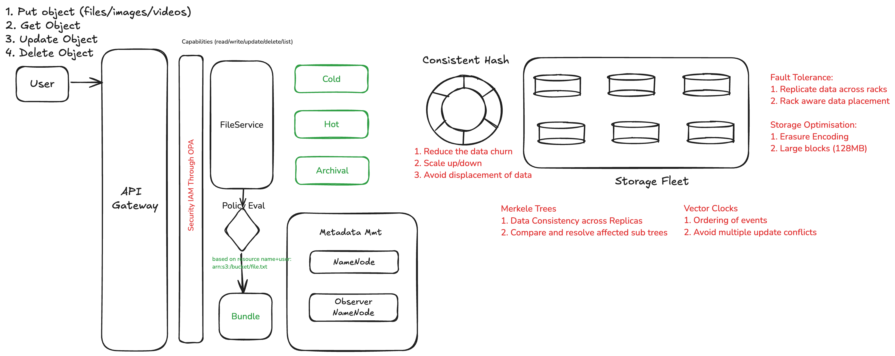

# Design ObjectStore

## Features
### Functional Requirements
1. User should be able to put file
2. User should be able to get file
3. Delete file
4. Update File
5. List File

### Non-Functional Requirements
1. System should be highly available
2. System should be fault-tolerant
3. System should be scalable

## API Specs
```
POST /v1/upload/{filename}
    Response - 201 Created
               409 Conflict if Key already Exists
               429 Too Many requests

GET /v1/get/{filename}
    Response - 200 OK
               401 UnAuthorised
               404 Not Found
               429 Too many requests

GET /v1/list/{path}
    Response - 200 OK
               401 UnAuthorised
               404 Not Found
               429 Too many requests

DELETE /v1/file/{path}
    Response - 200 OK
               401 UnAuthorised
               404 Not Found
               429 Too many requests                                                
```

## Estimations
Total Num of users - 100mil
DAU = 10Mil - 10 * 10^6
Reads:Writes (5:1)

### Storage Estimation
Write req payload can be around 1GB (10^9)
Writes = 10^7*10^9 = 10^16 = 10PB/day
### Servers
10 DAU = 120 req/sec
Each upload approx 1GB = 1Core = 100 req
Each upload takes = ~120 sec i.e. 2min = 14400 servers

### HLD


### Storage Tiers
1. Cold Storage
2. HOT Storage
3. Archival Storage

### Storage Optimisation
1. Erasure encoding
2. Parity blocks to recover from Disasters

### Replication
1. Rack aware replication
2. Multi Zone replication (DataCentre)

### Vector Clocks
1. Ensure of ordering of events
2. Resolve conflicts for updates

### Merkel Trees
1. Anti Entropy for consistency
2. Compare replicas

### OPA
1. IAM policies
2. Security/Authorisation based on capabilities

### Consistent Hashing
1. Ring placement of storage nodes
2. Upscale/downscale easily with less data churn
3. Hash Keys to identify storage nodes

### MetaData Management
1. NameNode lookup based on keys
2. Identify nearest node to fetch by key


