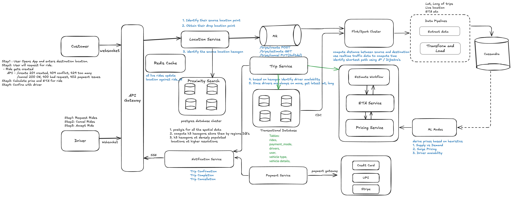

# Design system like Uber/Lyft/OLA

# Features
## Guest
1. Allow users to book cab
2. Allow users to choose vehicle type
3. Allow users to choose payment type

## Driver
1. Allow drivers to request ride
2. Allow drivers to cancel ride
3. Allow drivers to accept ride

## API Spec Guest
```
POST /v1/guest/rides/create
    Respone codes: 
        201 Created
        409 Conflict (When Ride is already in progress)
        429 Too many requests

GET /v1/guests/estimate 
     Respone codes: 
        201 Created
        409 Conflict (When Ride is already in progress)
        429 Too many requests

PUT /v1/guests/cancel
     Respone codes: 
        202 Accepted (Soft Delete)
        409 Conflict (When Ride is already in progress)
        429 Too many requests

POST /v1/guests/live?lat=X&lng=Y
     Respone codes: 
        200 OK          
```

## API Spec Driver
```
POST /v1/driver/rides/create
    Respone codes: 
        201 Created
        409 Conflict (When Ride is already in progress)
        429 Too many requests

PUT /v1/driver/cancel
     Respone codes: 
        202 Accepted (Soft Delete)
        409 Conflict (When Ride is already in progress)
        429 Too many requests

POST /v1/driver/live?lat=X&lng=Y
     Respone codes: 
        200 OK          
```

## Capacity Estimation
Total user base is 500mil
DAU - 100 mil Users
Read vs Write 5:1 (500mil reads: 100mil writes)

### Storage Estimation
1. Each user takes at-least 1 ride a day - 100 mil rides
2. Each ride generates appox 10 MB of data (10*10^6)
3. Each day 10^12*10 = 10TB/day 

### Server Estimation
1. 500mil req each day = 10^6*100
2. 1mil/86400 = 12 req/sec, 100mil req = 1200 req/sec
3. Each req can take approx 1sec.
4. System with 2 cores can handle 2 req/sec - 2 req/sec = 600 w/ 2cores each
5. System with 4 cores can handle 4 req/sec - 1200/4 = 300 w/ 4cores each

## High Level Design

### Services
1. Trip Service
2. Location Service
3. Payment Service
4. Proximity Search
5. Notification Service
6. Data Pipelines for processing

### Databases
1. Transaction DB for creating rides (Strong Consistency with ACID guarantees)
2. Postgres cluster, Sharded by location, like region (Citus can be used)
3. PostGIS extension on psql cluster
   - H3 extension and points hashed at resolution 7
4. Cassandra to handle live data flowing in through about rides, location etc
   - High write through put (Due to LSM trees)
   - Availability & Partition Tolerance (Eventual Consistent)
   - Clustered by user/ride sorted
   - Searchable on Memtable and SST with Bloomfilter better than B-Tree Index
   - Consist hash - Upscale/Downscale with lesser Data Churn


